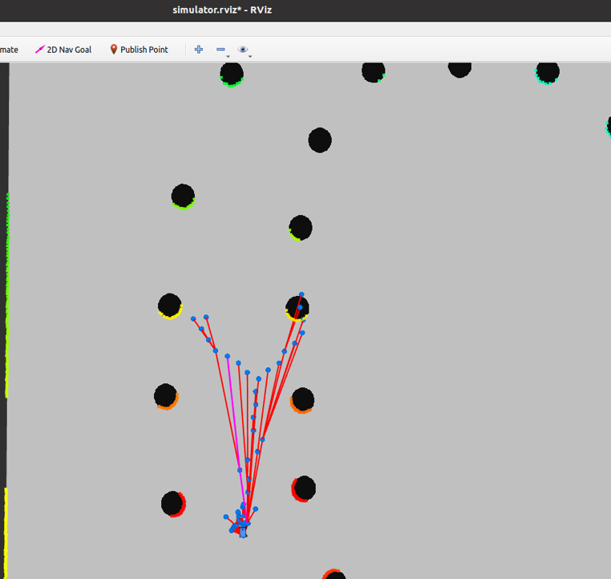

# RRT_STAR

This repository contains the race package implementing RRT and RRT* based path planning for an autonomous driving setup. It integrates perception, planning, and control modules to enable real-time motion planning and execution in simulation or hardware environments.

Developed and tested on ROS Noetic (Ubuntu 20.04).

<p align="center">
  
</p>

## Installation

Clone this repository into your ROS workspace and build it:

```bash
cd ~/catkin_ws/src
git clone https://github.com/satwikjain23/RRT_STAR.git
cd ~/catkin_ws
catkin_make
source devel/setup.bash

```
## Run

* Launch the simulator
```
rosrun f1tenth_simulator simulator.launch
```
<br>

* Run the Perception Node

```
rosrun race perception.py
```
<br>

* Run the RRT* Node

```
rosrun race rrt
```
> ADD /visualization_marker IN RVIZ BY TOPIC
<br>

* Run the Planning Node

```
rosrun race planning
```
<br>

* Run the Control Node

```
rosrun race cones_control.py
```

<br>

